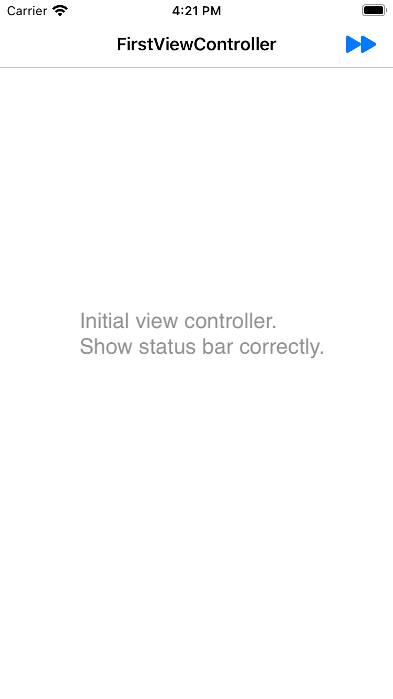
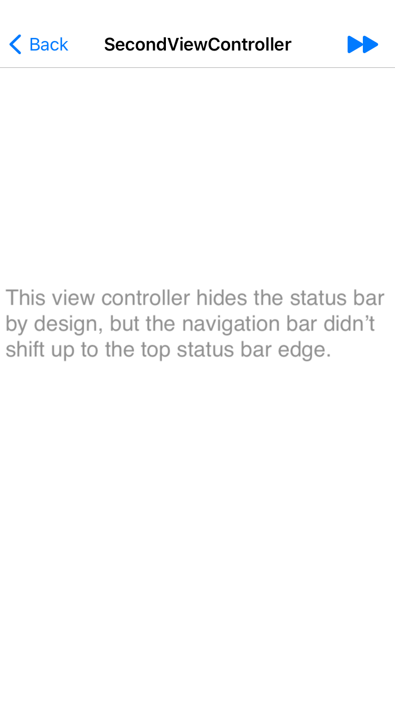
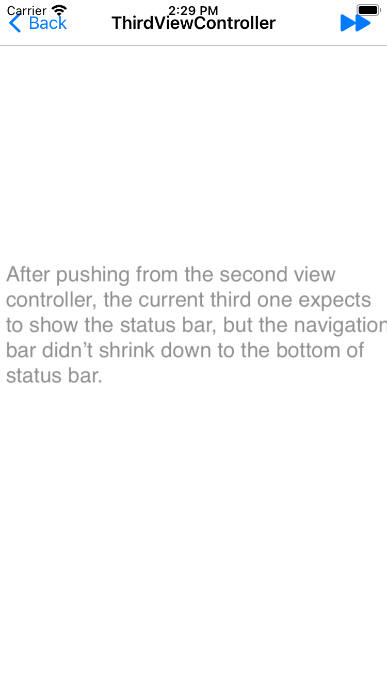
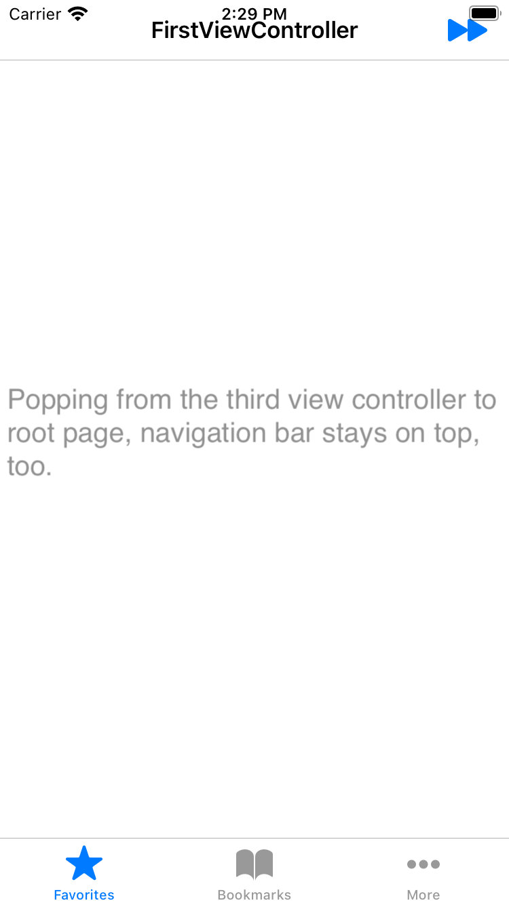

## Prefer Status Bar Control

#### Environment

* Xcode 12.3
* iOS Simulator / iPhone SE (2rd generation), or any other devices without safe area insets.

#### Demo Page Context

* `keyWindow.rootViewController` is s simple custom `UINavigationController`.
* FirstViewController is the rootViewController of navigation controller which expect the visible status bar.
* SecondViewController expects to hide the status bar.
* ThirdViewController expects to show the status bar, too.

#### Behaviors

The navigation bar didn’t update its layout after pushing from `FirstViewController` to `SecondViewController` and pushing from `SecondViewController` to `ThirdViewController`.

This issue only happens in non-notch iPhone including iPhone SE/7/8, for the device which has a top safe area inset, the status bar hidden property works as expected and navigation bar layout didn’t update.

#### Expection

* When pushing to the hidden status bar controller, navigation bar shift up.
* When pushing to the visible status bar controller, navigation bar sink down to top of status bar.

#### What I tried

1. Update the navigation bar frame manually in `viewLayoutMarginsDidChange`, it works but ugly!
2. Call the private method `_updateLayoutForStatusBarAndInterfaceOrientation` of `UINavigationController` in `viewLayoutMarginsDidChange`, it works but may be rejected when reviewing.

